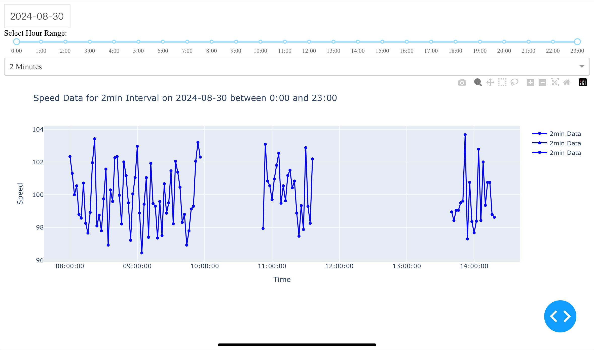

# Project Description

This project leverages an embedded system to create a dual-function vehicle dashboard with advanced data handling capabilities. The device performs two key functions:

1. **Digital Display**: It directly displays real-time vehicle data such as speed, estimated fuel usage per 100km, and fuel percentage on a built-in 3.5-inch screen.
  
2. **Website Dashboard**: Simultaneously, the device hosts a web interface accessible via Wi-Fi. This dashboard, built with React for the frontend and Express.js for the backend, provides detailed statistical data, including graphs, averages, and diagnostic codes. Data is managed using PostgreSQL, and there is an option to upload the data to Amazon S3 buckets for permanent storage and further analysis.

## Features

- **Real-Time Speed Display**: Continuously reads and displays the vehicle's speed on the device's built-in screen.
- **Estimated Fuel Usage**: Calculates and displays the estimated fuel usage per 100km on the screen.
- **Fuel Percentage**: Displays the remaining fuel as a percentage of the tank's capacity on the screen.
- **Diagnostic Codes**: Provides real-time diagnostic codes from the vehicle's OBD system, accessible via the hosted website.
- **Statistical Dashboard**: Displays detailed graphs and averages of vehicle data through a web interface hosted by the device.
- **Wi-Fi Connectivity**: The device hosts a local network, allowing users to connect via Wi-Fi and automatically display the dashboard on a connected device.
- **Automatic Startup**: The program runs automatically on system startup using a systemd service.
- **Portable Power**: Capable of running on a battery pack for portability.
- **Flexible Display Options**: Data is displayed on both the device's built-in screen and the web interface.

## Future Features

- **Aiming to add AI systemn to detect anomolies**

## Software Components
- **Data Management:** Uses PostgreSQL to store and manage vehicle data, enabling complex queries and data integrity.
- **Python Data Handling:** Maintains a live connection to the car's OBD-II system to retrieve data and perform initial analysis before serving it to the digvital display and storing it in PostgreSQL (which is further supported by a data buffer)]
- **Plottly API:** Used to build both static and interactive graphs for data visulisation
- **CarMD API:** Uses external api, CarMD, to describe what a diagnostic code means for the user
- **Rest API For Data Retrival:** A service built with golag to interact with postgres database and retrieve requested data
- **Gateway API:** Service to handle user interactions with frontend
- **Front end:** The dashbored user interface is built with Express.js
- **Data bufer:** Python script to increamently store data before uploading to postgress and serving to digital disaply
- **Cloud Integration:** Option to upload data to Amazon S3 buckets for permanent storage, accessible through a public website.

## Physical Components

- **Embedded System Board** (e.g., Raspberry Pi Zero W)
- **3.5-inch Display** (SPI or HDMI)
- **ELM327 OBD-II to USB Interface**
- **PowerBoost 1000C** (or similar)
- **LiPo or Li-Ion Battery Pack** (Optional for portable power)
- **MicroSD Card** (16GB or larger)

## Screenshot

Here is a screenshot of the dashboard:

